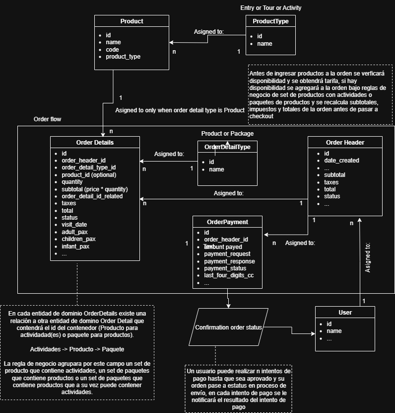
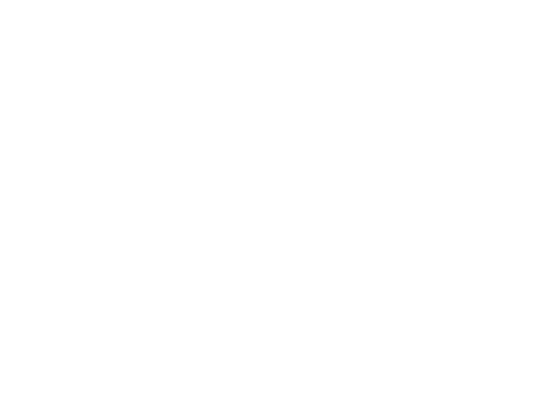

# Documentación

## Diagrama de dominio

## Diagrama de casos de usos

## Arquitectura del repositorio

En la carpeta src encontramos una arquitectura basada en componentes para la construcción de una single page application, donde se definen páginas (Pages) y rutas (Router), todas trabajan en conjunto formando el aplicativo de tipo single page coordinando su carga en archivo raiz de src de nombre index.tsx.

Para el renderizado dinámico de cada página del aplicativo utilizando servicios de terceros se utiliza Clean Achitecture (Presentación -> Aplicación - Infraestructura -> Dominio). En la carpeta Domain encontramos nuestros modelos anémicos y patrones DTO para el mapeo de infraestructura y mapeo de presentadores para compnentes react en caso de requerir. En la carpeta Infrastructure se encuentran los repositorios que requiere la página que se esté renderizando de acuerdo a la ruta definida por react. En la carpeta UseCase se colocan reglas de aplicación una vez obtenidos los datos de la capa de infraestructura en caso de requerir. En la carpeta Service que funge como capa presentadora se recibe la información ya sea de repositorios o casos de uso para ser utilizada por los componentes de cada página renderizada por react.

Al ser un código debilmente acoplado se utiliza inversión de dependencia y el resto de los 4 principios S.O.L.I.D. cumpliendo con las reglas de construcción de la arquitectura mencionada, dejando en nuestro contenedor las dependencias necesarias para el renderizado de cada página en react.

En la carpeta Shared se encuentran todos los recursos que el aplicativo puede reutilizar durante la ejecución de cada regla de negocio y renderizado.

En la carpeta Context (Estado de aplicación) se utiliza todo recurso que puede ser compartido en mas de una página, por ejemplo: un contexto de datos que almacene los datos de la orden durante todo el flujo del e-commerce, esta funcionalidad es muy parecida al patrón de estado de aplicación que maneja redux.
